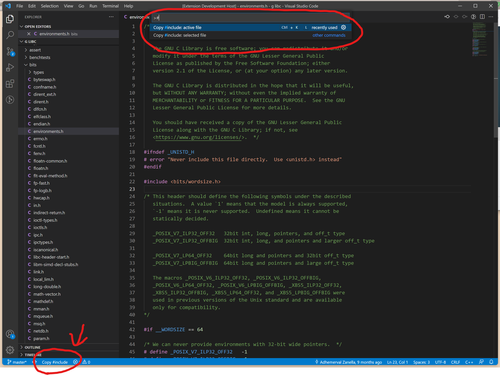
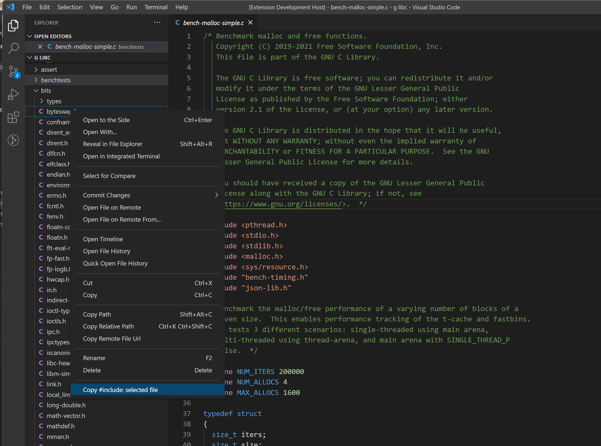

# copy #include

C/C++ developers write `#include` a lot. Though language servers can help, it's still boring and error-prone to typing it again and agin.

This extension copys `#include` directive of the active file, or selected file in explorer. You can access the power from command palette, keyboard shortcut(`ctrl+k l`), status bar item, or explorer context menu. 

The header search path is set to `${workspaceFolder}` out of box. You're free to customize it per project at any time.

## Features
### Copy #include of active file, from command palette or status bar


### Call from explorer context menu


### Specify header search path for different projects
```json
// .vscode/settings.json
{
  // Note: the order matters. Usually narrower paths are put ahead. 
  "copyInclude.headerSearchPath.path": "${workspaceFolder}/include:${workspaceFolder}"
}
```

## Extension Settings

```json
{
  // show status bar item for active header file
  "copyInclude.accessPoint.statusBar": true,
  // include search path
  "copyInclude.headerSearchPath.path": "${workspaceFolder}/include:${workspaceFolder}",
  // whether to refer to .vscode/c_cpp_properties.json for the include search path. 
  // If it's on, `copyInclude.headerSearchPath.path` will be ignored.
  "copyInclude.headerSearchPath.useCCppPropertiesJSON": false
}
```

## Release Notes

### 0.0.5

Fix README.md picture path.

### 0.0.4

1. Add keyboard shortcut: `ctrl+k l`.
2. Fix path delimter replace error on Windows.

### 0.0.3

1. Add a status bar item to copy #include of the current file. It's enabled by default for convenience and can be disabled in the preferences. 
2. You can now specify project include directories in the preferences. Or, you can set the extension to refer to the `.vscode/c_cpp_properties.json` file. 

### 0.0.2

Add a context entry in the file explorer to copy #include of the selected file.

### 0.0.1

Initial release. Support getting #include from current open file.

## Known issues

For now, the extension doesn't support replacing env varibales defined in `.vscode/c_cpp_properties.json`. But it's promising to come in next big version.
