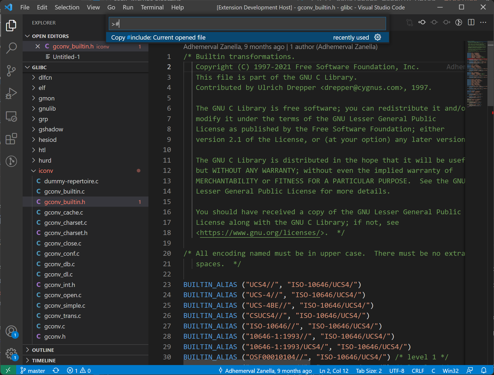

# copy #include

C/C++ developers mannuly write `#include` a lot. Although language server can help on auto-completion, it's still both boring and error-prone to typing the `#include "..."` again and agin.

This extension helps you get `#include` directive of the current open file. 

## Features

Describe specific features of your extension including screenshots of your extension in action. Image paths are relative to this README file.

For example if there is an image subfolder under your extension project workspace:

> Tip: Many popular extensions utilize animations. This is an excellent way to show off your extension! We recommend short, focused animations that are easy to follow.

## Extension Settings

This extension doesn't require settings, for now.

## Release Notes

### 0.0.3

1. Add a status bar item to copy #include of the current file.
2. Support reading project include directories and calculate appropriate #include directive.

### 0.0.2

Add a context entry in the file explorer to copy #include of the selected file.

### 0.0.1

Initial release. Support getting #include from current open file.

